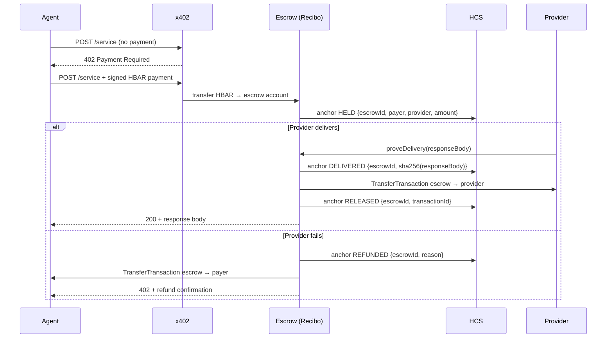

# Recibo

Escrow and delivery proof layer for x402 agent payments on Hedera.

---

## The Problem

The x402 protocol gives AI agents a clean rail for machine-to-machine micropayments. What it does not give them is a receipt. Once a payment settles, it settles. If the service took the money and never responded, the agent has no reversal path, no on-chain record of what was delivered, and no audit trail of what it spent.

At one payment per API call, an agent making thousands of calls a day is running blind. The ecosystem is building the payment rail. Nobody is building the receipt.

---

## How It Works



Every state transition — HELD, DELIVERED, RELEASED, REFUNDED — is anchored in Hedera Consensus Service before the response is sent. The audit trail is immutable and public.

---

## Live Evidence

These are real testnet transactions from a demo run, verifiable by anyone:

- **HCS topic** (full audit trail, 11+ messages): [hashscan.io/testnet/topic/0.0.10485281](https://hashscan.io/testnet/topic/0.0.10485281)
- **Refund transaction** (HBAR returned to payer on provider failure): [hashscan.io/testnet/transaction/0.0.10486724@1789167064.392425188](https://hashscan.io/testnet/transaction/0.0.10486724@1789167064.392425198)

No need to trust our server. Open either link and read the chain directly. The sequence numbers are monotonic, the consensus timestamps are final, and the HBAR balances moved as recorded.

---

## Why Hedera

Two concrete reasons this only works economically on a low-fee chain:

**Cost of reversal.** The refund transaction in the demo above cost **$0.00010**. At that cost, reversing a $0.001 micropayment is viable — the fee is 10% of the payment. On a chain where a transaction costs $1–5, reversing a micropayment is economically absurd. You would not build this product there.

**Sponsored gas.** The settlement transaction fee is paid by the x402 facilitator ([Blocky402, account 0.0.7162784](https://hashscan.io/testnet/account/0.0.7162784)), not by the agent. The paying agent needs zero HBAR for gas — only the HBAR amount of the service itself. This is visible in the transaction fee payer field on every settlement. It means an agent can participate with just a funded HBAR balance, no native-token overhead for fee management.

---

## Running It

**Prerequisites**

- Node.js 20+
- A Hedera testnet account with HBAR (payer)
- A second testnet account (provider/receiver)

**Environment variables** (copy `.env.example` or create `.env`):

```
HEDERA_NETWORK=testnet
FACILITATOR_URL=https://api.testnet.blocky402.com
PAYER_ACCOUNT_ID=         # agent that pays for the service
PAYER_PRIVATE_KEY=        # ECDSA hex key (0x...)
RECEIVER_ACCOUNT_ID=      # provider account that receives payment on release
ESCROW_ACCOUNT_ID=        # escrow holding account (created below)
ESCROW_PRIVATE_KEY=       # ECDSA hex key for escrow (created below)
HCS_TOPIC_ID=             # HCS topic for audit trail (created below)
```

**First-time setup**

```bash
npm install

# Create the HCS topic — prints HCS_TOPIC_ID to paste into .env
npm run create-topic

# Create the escrow account — prints ESCROW_ACCOUNT_ID + ESCROW_PRIVATE_KEY
npm run create-escrow-account
```

**Running**

```bash
# Terminal 1: API server (port 3333)
npm run server

# Terminal 2: Next.js dashboard (port 3000)
npm run dashboard

# Terminal 3: trigger a payment
npm run pay                     # happy path → HELD → DELIVERED → RELEASED
npm run pay -- /service-flaky   # sad path   → HELD → REFUNDED
```

Open [http://localhost:3000](http://localhost:3000) to watch escrow state update in real time (3-second polling).

---

## Architecture

| File | Role |
|---|---|
| `src/server.js` | Express server. `POST /service` (happy path), `POST /service-flaky` (refund demo), `GET /escrows`, `GET /escrow/:id`, `GET /status`. Payment middleware routes to escrow account, not directly to provider. |
| `src/escrow.js` | Core logic. In-memory Map with five operations: `hold`, `proveDelivery`, `release`, `refund`, `getEscrow`, `getAllEscrows`. Each operation anchors to HCS before returning. State machine enforces valid transitions: HELD → DELIVERED → RELEASED, HELD → REFUNDED. |
| `src/hcs.js` | Single export: `anchor(payload)`. Submits JSON to HCS topic and returns `{ topicId, sequenceNumber, consensusTimestamp, transactionId }`. Uses `getRecord()` (not `getReceipt()`) because `consensusTimestamp` is only available in the transaction record. |
| `src/pay.js` | CLI client. Accepts route as argument. Handles 402 challenge, signs with PAYER key, prints settlement header and full escrow history from `GET /escrow/:id`. |
| `web/app/page.tsx` | Next.js 15 dashboard. Read-only, client-side polling. Shows all escrows with state, HCS sequence numbers, sha256 delivery proofs, and direct HashScan links. |
| `scripts/create-topic.js` | Creates HCS topic on testnet. Run once. |
| `scripts/create-escrow-account.js` | Generates new ECDSA keypair, creates Hedera account funded from PAYER. Run once. |
| `scripts/test-escrow.js` | Runs happy path and sad path end-to-end from the command line. |

---

## Design Decisions and Known Limits

**Escrow is in-memory.**
State lives in a `Map` on the server process. It does not survive a restart. This was a deliberate choice to keep the hackathon scope manageable. Any escrow in HELD or DELIVERED state at restart is unrecoverable without a database. Persistence (Postgres or serialized to disk) is the first post-hackathon addition.

**Delivery proof is sha256 of the response body, nothing else.**
`proveDelivery({ escrowId, responseBody })` computes `sha256(responseBody)` and anchors it in HCS. There is no arbitration, no LLM judge, no voting mechanism. If the server returned a body, that counts as delivery. This is a deliberate design choice: it keeps the system fully trustless and auditable without any subjective layer. Dispute resolution for content quality is a separate problem.

**No automatic escrow timeout.**
If a provider receives payment and never calls `proveDelivery` or `release`, the HBAR stays locked indefinitely. A timeout with automatic refund was excluded from the hackathon scope to avoid complicating the state machine. It is the second post-hackathon addition.

**`allowedAssets` restricts to HBAR but has no amount cap.**
The x402 client configures `allowedAssets: [{ asset: '0.0.0', network: 'hedera:testnet' }]` to allow native HBAR payments. Without `maxAmountPerPayment`, the spend guard accepts any amount of HBAR from any payment request. This is acceptable for a demo with known routes, but a production agent should set a per-payment cap.

---

## What's Next

- **Persistence**: replace the in-memory Map with Postgres or a serialized flat file so escrow state survives restarts.
- **Automatic timeout**: release a refund automatically if `proveDelivery` is not called within N seconds of `hold`.
- **Per-agent spend cap**: enforce `maxAmountPerPayment` in tinybars so the agent has a hard ceiling on what any single payment can take.
